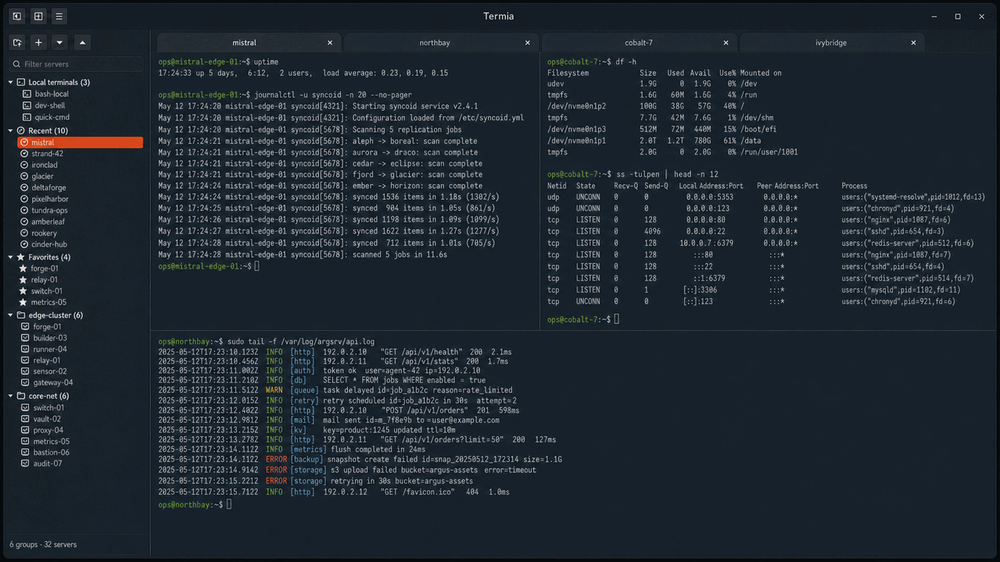

# Termia

Termia is a GTK 4 SSH connection manager with embedded VTE terminals for
Linux desktops.



Spanish documentation: [docs/README.es.md](docs/README.es.md)
Catalan documentation: [docs/README.ca.md](docs/README.ca.md)
Roadmap: [ROADMAP.md](ROADMAP.md)

## Features

- Run SSH connections and local terminals in embedded GTK 4 VTE terminals.
- Work with multiple tabs, detachable windows, and terminal split panes.
- Save split layouts per SSH server or local terminal profile to reopen a workspace ready to use.
- Upload local files to remote servers with SCP from the terminal or server context menu.
- Keep connection data locally with plain, obfuscated, or optional encrypted storage protected by a master password.
- Organize connections with nested groups, favorites, and a duplicate-free Recent section; find them quickly with `Ctrl+F`.
- Store host, user, port, password, and private-key settings for each SSH connection.
- Import and export Termia configuration, including basic connections, nested groups, and available credentials from Asbru YAML.
- Review connection history and optional local usage statistics, including durations and most-used servers.
- Customize terminal colors, fonts, local prompts, keybindings, confirmations, session status bars, language, and safe multi-instance behavior.

## Download and install (Ubuntu 24.04+)

Download [termia_0.5.0.beta-4_all.deb](https://github.com/buuuki/termia/releases/download/v0.5.0-beta/termia_0.5.0.beta-4_all.deb)
and install it with APT, which resolves the required dependencies:

```bash
sudo apt install ./termia_0.5.0.beta-4_all.deb
```

## Download from source

Clone the complete repository instead of downloading individual files:

```bash
git clone https://github.com/buuuki/termia.git
cd termia
```

## Install from source

Termia uses system GTK and VTE packages. Install missing dependencies, verify the
result, and add a user-local desktop launcher with:

```bash
chmod +x scripts/termia-setup.sh
./scripts/termia-setup.sh install
```

Before changing the system, the setup script lists the planned actions and waits
10 seconds so you can cancel. On Debian, Ubuntu, and Linux Mint, if `apt-get update`
fails because a configured repository is unavailable, it asks before using the
existing APT cache to install the required packages. If all runtime dependencies
are already available, it does not run the system package manager.

The dependency installer supports Debian, Ubuntu, Linux Mint, Fedora, and Arch Linux
package managers. It also tries to install JetBrains Mono for the default terminal
font; new installations use the Polaris palette and a white prompt color by
default, and Termia falls back to Ubuntu Mono or Monospace at runtime if JetBrains
Mono is unavailable.
Other Linux distributions require equivalent packages.

If the check reports a missing `Vte 3.91` namespace, the GTK 4 VTE introspection
package is missing. On Debian, Ubuntu, or Linux Mint the package is
`gir1.2-vte-3.91`.

## Run from a clone

```bash
python3 run_termia.py
```

To test a branch without closing your usual Termia window, launch an isolated
profile. It uses separate configuration, state, and writer lock:

```bash
./scripts/run_test_instance.sh --copy-current-config pr-152
```

The option copies connections, settings, connection history, statistics, and
the debug log into the test profile. Changes made there never modify your usual
Termia data.

For diagnostic information about GTK rendering, VTE sessions, storage locks,
encryption, and read-only startup, enable `Debug mode` in General preferences. It
can also be enabled for one run with:

```bash
python3 run_termia.py --debug
```

Debug output is written to `~/.local/state/termia/debug.log`. It does not log
passwords or connection contents.

The launcher is installed at
`~/.local/share/applications/local.termia.desktop` and its icon under
`~/.local/share/icons/hicolor/scalable/apps/`.

Run the installer again after moving the cloned directory because the desktop
entry stores an absolute path to the source-checkout launcher.

Remove the launcher without deleting settings, connections, statistics, or system
packages:

```bash
./scripts/termia-setup.sh uninstall
```

## Build a Debian package

On Debian, Ubuntu 24.04 or newer, or a compatible derivative, install the build
dependencies and create the package from the repository root. Ubuntu 22.04 and
earlier do not provide the required GTK 4 VTE runtime:

```bash
sudo apt build-dep .
dpkg-buildpackage -us -uc -b
```

The resulting `termia_0.5.0~beta-4_all.deb` is created in the parent directory.
Install it with:

```bash
sudo apt install ../termia_0.5.0~beta-4_all.deb
```

The Debian package installs the `termia` command, desktop launcher, and icon;
APT installs its GTK, VTE, Python, SSH, and encryption dependencies.

## Usage notes

The `Configuration` menu is split into `General`, `Terminal`, `Prompt`, `Keybindings`, and `Security`:

- `General` controls the application theme, language, confirmations, startup behavior, password shortcut behavior, and the session status bar, which starts hidden by default.
- `Terminal` controls the embedded VTE terminal font, size, foreground/background colors, split separator color/thickness, and color palettes. New installations start with JetBrains Mono and the Polaris palette.
- `Prompt` customizes local terminal PS1 color, presets, and time/date prefixes. The default prompt color is white. It does not alter SSH commands or modify remote shell startup files.
- `Keybindings` shows the active shortcuts and lets you record shortcut combinations for common actions such as server filtering, sidebar visibility, opening a local terminal, focus navigation, copy, paste, tab switching, font zoom, and sending the saved password. `Ctrl+F` focuses the server filter, `Ctrl+Shift+B` toggles the server list, `F10` toggles the main menu, `Ctrl+Shift+T` opens a local terminal, and `Ctrl+F6`/`Ctrl+Shift+F6` cycle through the main interface regions. Other unmodified function keys pass through to terminal applications.
- `Security` controls connection storage mode.
- Use the terminal-shaped button in the sidebar to create a new local terminal profile; it appears in the sidebar list like a connection and opens an embedded terminal when activated.
- When another Termia instance is already running with the write lock, a new window opens in read-only mode, shows a header badge, disables write-capable actions, and still allows browsing, connecting, and exporting configuration.
- Right-click a terminal or a server to upload files to `/tmp/.termia/` on the target host.
- The main menu includes connection history, data file locations, and import/export actions.

Each session can show a status bar with its state, PID, elapsed time, a compact hide button, and disconnect. Enable or disable session status bars from `General`; if a session status bar is hidden, right-click inside the terminal and choose `Show session status bar` to restore it. The sidebar has its own header toggle. Right-click inside a terminal to access translated `Split` and `Tab` submenus; split panes can be created up, down, left, or right, and a pane disappears automatically when its shell exits. A tab only closes on `exit` once the last terminal has exited and no split panes remain.

## Tested environment

Termia has been tested on Ubuntu 24.04.4 LTS with Linux kernel
6.8.0-117-generic, GNOME 46.0, and Wayland.

## Supported runtime baseline

Termia requires Python 3.10 or newer, GTK 4.0/GDK 4.0, and the GTK 4 VTE
introspection namespace `Vte 3.91`. The current validation environment provides
GTK 4.14.5 and VTE 0.76.0. Compatibility guards for optional GTK methods such as
`set_handle_menubar_accel` and `set_show_separators` remain intentional so the
same source can run across distributions that expose different GTK API levels.

## Project layout

```text
run_termia.py                     Source-checkout launcher
src/termia/app.py             Application composition and window setup
src/termia/                Feature modules for storage, dialogs, tabs, terminal sessions, and UI helpers
src/termia/__main__.py        Python module entry point
src/termia/assets/            Desktop and About dialog artwork
src/termia/locale/            Compiled gettext catalogs bundled with Termia
po/                           Editable gettext translation catalogs
scripts/compile_translations.py
scripts/termia-setup.sh
docs/README.es.md             Spanish documentation
docs/README.ca.md             Catalan documentation
SECURITY.md                    Credential storage warning
THIRD_PARTY_NOTICES.md         Runtime dependency licenses
LICENSE                       GPL-3.0-or-later license
```

The GTK implementation is split into focused modules for application composition,
storage, import, dialogs, preferences, sidebar, tabs, terminal sessions, and UI
helpers without changing the launch command.

## User data and security

Termia stores connection data, settings, and statistics outside the repository:

```text
~/.config/termia/connections.json   # groups and servers
~/.config/termia/settings.json      # app and terminal settings
~/.config/termia/instance.lock      # single writer lock for multi-instance mode
~/.local/state/termia/recent_connections.jsonl
~/.local/state/termia/statistics.json
```

Saved passwords are stored in `connections.json`; the file can be kept as plain text, obfuscated, or encrypted with a master password from Security preferences. When encryption is enabled, Termia asks for the master password on startup and cannot recover the connection data if that password is lost. Imported Ásbrú passwords are stored the same way when the source YAML exposes them in a `pass` field. Exported connection files can also contain passwords. Aggregate usage counters are stored separately in `statistics.json`. When several Termia processes are open at the same time, only the instance holding `instance.lock` writes connections, settings, or statistics; later instances stay read-only to avoid corrupting these files.
Recent connections are stored separately in `recent_connections.jsonl` so the sidebar can keep a small, deduplicated Recent section based on the latest successful SSH connections.

Termia does not store typed text, command contents, clipboard contents, command counters, or keystroke counters. Statistics are disabled by default and can be enabled from General preferences. When enabled, they track only aggregate connections, per-server usage, and session durations; they are flushed at most every 30 seconds, when sessions end, and when Termia closes. See [SECURITY.md](SECURITY.md).

Python may create `__pycache__/` directories next to executed modules. They only
contain generated bytecode, are excluded by `.gitignore`, and must not be
committed or distributed.

## License

Termia is licensed under the [GNU General Public License v3.0 or later](LICENSE).

Runtime dependencies are installed separately by the operating system and are
not vendored in this repository. See [THIRD_PARTY_NOTICES.md](THIRD_PARTY_NOTICES.md).

## Development checks

After editing `po/es.po` or `po/ca.po`, compile the gettext catalogs before
running Termia:

```bash
scripts/compile_translations.py
```

Use `scripts/compile_translations.py --check` to verify that `MESSAGES`, the
POT template, both PO catalogs, and the compiled MO files are synchronized.

```bash
PYTHONPATH=src python3 -m unittest discover -s tests -v
python3 -m py_compile run_termia.py scripts/compile_translations.py src/termia/app.py src/termia/asbru_import.py src/termia/config_actions.py src/termia/config_io.py src/termia/connection_dialogs.py src/termia/connection_utils.py src/termia/constants.py src/termia/i18n.py src/termia/keybindings.py src/termia/main_menu.py src/termia/main_menu_actions.py src/termia/models.py src/termia/preferences.py src/termia/sidebar.py src/termia/statistics_utils.py src/termia/statistics_view.py src/termia/stores.py src/termia/styles.py src/termia/tabs.py src/termia/terminal_menu_actions.py src/termia/terminal_menus.py src/termia/terminal_sessions.py src/termia/terminal_config.py src/termia/ui_state.py
bash -n scripts/termia-setup.sh
```

The same unit tests, translation checks, and Python syntax checks run
automatically in GitHub Actions for every pull request and every push to
`main`.

Review the files included in the first commit:

```bash
git status --short --ignored
git ls-files --others --exclude-standard
```
